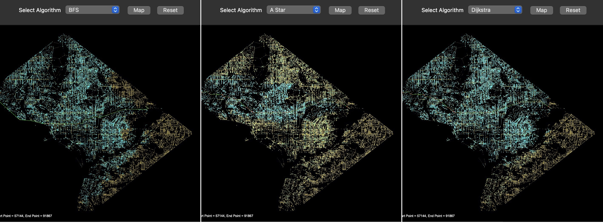
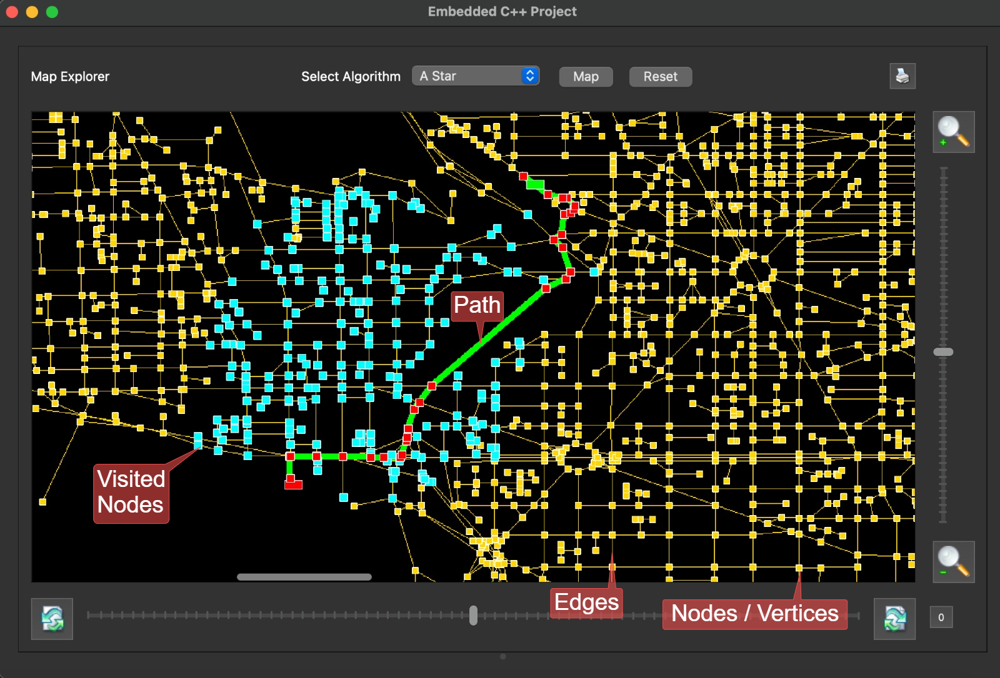
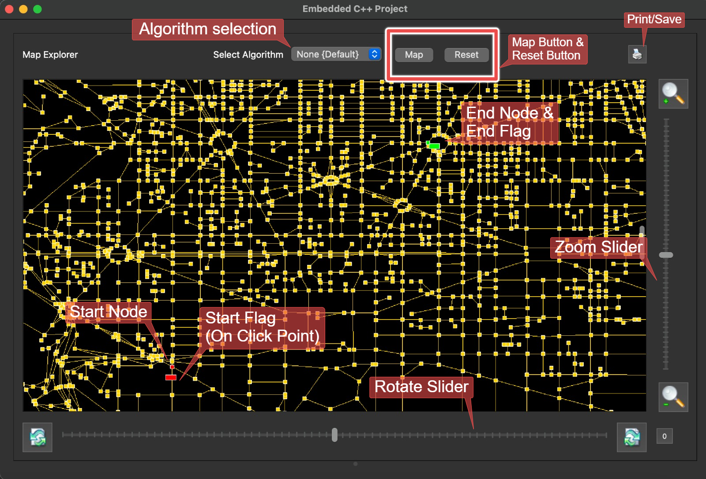

# Map_Path_Finder

C++ and Qt Based GUI Application for Path finding algorithms in the city map.

## Introduction
Map Path Finder is a C++ based GUI application developed with Qt for creating and rendering maps. It allows users to visualize the shortest path between two selected points on the map using various path finding / Graph algorithms. This project demonstrates the implementation of a graph library and three search algorithms: Breadth First Search (BFS), Dijkstra's Algorithm, and A* (A-star) Search Algorithm.

---

### Graphical User Interface

 

- **Map Area:** Displays the loaded city map with vertices and edges.
- **Dropdown Menu:** Allows selection of the pathfinding algorithm.
- **Map Button:** Initiates the rendering of the path found by the selected algorithm and the visited nodes.
- **Reset Button:** Resets the map view and clear the path visualizations.

---

## Procedure
1. Launch the application.
2. Load a graph data - CSV file.
3. Select the start and End node in the map area.
4. Select the desired pathfinding algorithm from the dropdown menu.
5. Click on "Map" to visualize the graph and the computed path.
6. Use the interactive features such as zoom and reset for better navigation.

---

### Developers / Authors

- Philipp AHRENDT
- Sivadinesh PONRAJAN

### References

Detailed implementation and theoretical background can be found in the [project report](./report.pdf).